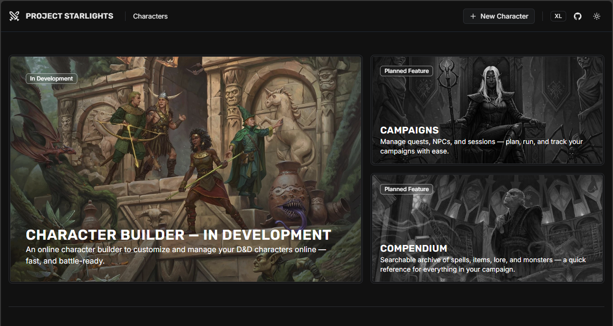

# Project Starlights

This is a work-in-progress project intended as an online toolset to enhance tabletop role‑playing games. Its initial focus is creating characters for Dungeons & Dragons in the form of an online version of [Aurora](https://www.aurorabuilder.com), which was my original creation years ago.

There is no public-facing website hosted for this project at this time, and more details will be shared as development progresses.

If you'd like to see this project grow, please consider giving it a star :star: — thank you!

<hr />

_This is a screenshot from the experimental Development UI in this project._



## Tech Stack

### Backend

- **Modular Monolith Architecture**: Domain modules (Elements module for game data, Characters module for character building) built on a shared platform layer
- **Entity Framework Core 10 + SQL Server**: Data persistence with explicit configurations and migrations
- **.NET 10 Web API**: Using FastEndpoints for REPR pattern endpoints
- **.NET Aspire 13**: Local orchestration and Azure deployment ready
- **Observability**: Serilog for logging, OpenTelemetry for distributed tracing and metrics

### Frontend (Experimental)

- **React 19** (TypeScript)
- **Vite 7**: Fast build tooling
- **Tailwind CSS 4**: Utility-first styling
- **Shadcn UI**: Composable UI components
- **TanStack Query 5.87**: Server state management
- **React Router 7**: Client-side routing
- **React Hook Form + Zod**: Form validation

### Testing

- **MSTest**: Test framework
- **FluentAssertions**: Expressive assertion library
- **Moq**: Mocking framework for unit tests
- Integration tests using WebApplicationFactory pattern

## Prerequisites

- Windows, macOS, or Linux with Docker (required for local SQL Server container via Aspire)
- .NET SDK 10
- Node.js 20+
- Docker Desktop (or compatible container runtime)

## Getting Started (local)

The recommended way to run locally is via the .NET Aspire AppHost, which:

- Creates a persistent SQL Server container with fixed port `61070` for development
- Runs EF Core migration workers for Characters and Elements modules
- Starts the backend API with service discovery and telemetry wiring
- Launches the React Builder App (Vite dev server) with external URL
- Provides Aspire dashboard for monitoring resources, logs, and metrics

### Start the Application

Run the AppHost project:

```powershell
dotnet run --project src/aspire/Starlights.AppHost
```

Once running:

1. Open the Aspire dashboard (URL shown in console output)
2. Initialize the database by running the "Initialize Database" command on the `backend` resource, or manually hitting `/api/elements/initialize`
3. Access the frontend at the external URL shown in the dashboard (typically `http://localhost:5173`)

## Tests

- **Unit tests**: Located in `*.Tests` projects (Platform, Characters, Elements modules)
- **Integration tests**: Under [`src/tests/integration/Starlights.Integration.Tests`](src/tests/integration/Starlights.Integration.Tests)

Run all tests:

```powershell
dotnet test
```

Run tests with coverage (configured in [`.runsettings`](.runsettings)):

```powershell
dotnet test --settings .runsettings
```

## Architecture

### Modular Monolith

- Organized by business capability with strict module boundaries
- **Elements Module** ([`src/modules/elements`](src/modules/elements)): Game data elements (classes, abilities, features, etc.)
- **Characters Module** ([`src/modules/characters`](src/modules/characters)): Character creation and management
- **Platform Layer** ([`src/platform`](src/platform)): Shared hosting, logging, data infrastructure, and eventing

Each module follows internal layering:

- `Domain`: Entities, value objects, aggregates, and domain logic
- `Data`: Repositories and abstractions
- `Data.EntityFramework`: EF Core configurations, DbContext, and migrations
- `Endpoints`: FastEndpoints for API exposure
- `Integration`: Public contracts for inter-module communication

### Key Patterns

- **REPR (Request-Endpoint-Response)**: Each endpoint is self-contained with typed request/response
- **Domain Events**: Pub/sub pattern for module communication
- **DI-first**: All dependencies injected via constructor, leveraging nullable reference types for safety
- **EF Core Configurations**: Explicit `IEntityTypeConfiguration<T>` for all entities (see repository-specific rules in [`copilot-instructions.md`](.github/copilot-instructions.md))

## Database

- **Local Development**: SQL Server container via Aspire AppHost
- **Connection**: Surfaced via Aspire service discovery (`ConnectionStrings__charactersdb`, `ConnectionStrings__elementsdb`)
- **Static Port**: `61070` (configurable in [`src/aspire/Starlights.AppHost/AppHost.cs`](src/aspire/Starlights.AppHost/AppHost.cs))
- **Migrations**: Automatic via migration workers at startup; EF Core migrations in respective `*.Data.EntityFramework` projects

## API Documentation

In Development, the backend exposes:

- **OpenAPI spec**: `/openapi/v1.json`
- **Scalar API Reference UI**: `/scalar` (interactive documentation)
- **API prefix**: All endpoints under `/api`

FastEndpoints are grouped by module and version (e.g., [`CharactersGroup`](src/modules/characters/Modules.Characters.Endpoints/CharactersGroup.cs)).

## Troubleshooting

| Issue                             | Solution                                                                                                                 |
| --------------------------------- | ------------------------------------------------------------------------------------------------------------------------ |
| **Docker not running**            | Start Docker Desktop (or your container runtime) before launching AppHost                                                |
| **Port `61070` in use**           | Change the port in [`AppHost.cs`](src/aspire/Starlights.AppHost/AppHost.cs) and re-run AppHost                           |
| **Database not initialized**      | Ensure AppHost is started and migration workers complete; manually trigger via `/api/elements/initialize`                |
| **Frontend can't connect to API** | Check Aspire dashboard for backend resource status; verify `VITE_API_BASE` environment variable                          |
| **EF Core migration errors**      | Ensure SQL Server container is running and connection string is correct; check migration worker logs in Aspire dashboard |

## License

This project is being developed in the open under the [MIT License](./LICENSE).

## Acknowledgements

This project builds on experience developing [Aurora](https://www.aurorabuilder.com).
